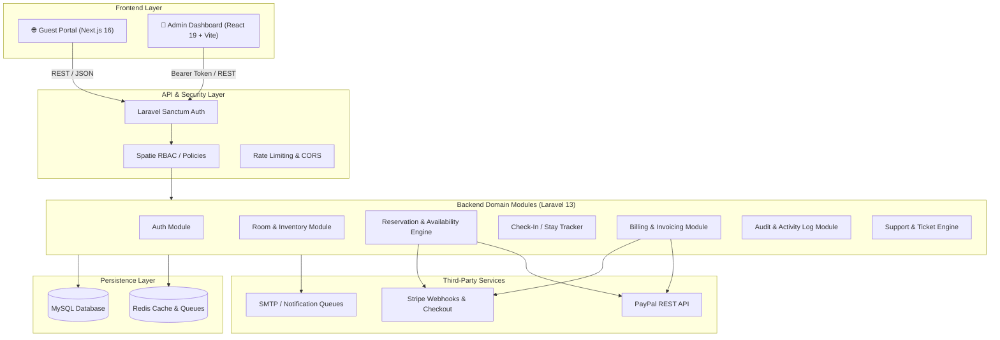

# 🏨 Grand Luxury HMS — Enterprise Hotel Management System

[](https://laravel.com)
[](https://nextjs.org)
[](https://react.dev)
[](https://www.typescriptlang.org)
[](https://tailwindcss.com)
[](https://www.php.net)
[](https://stripe.com)
[](https://paypal.com)
[](https://opensource.org/licenses/MIT)

**Grand Luxury HMS** is an enterprise-grade, full-stack Monorepo Hotel Management & Reservation System designed for modern hospitality businesses. Built with a **Modular/Domain-Driven Laravel REST API**, an **Admin Management Dashboard (React 19 + TypeScript + Vite)**, and a high-performance **Guest Booking Portal (Next.js 16 App Router)**.

---

## 🌟 Executive Summary & Portfolio Highlights

This project showcases production-ready architecture, clean code standards, enterprise security, and modern full-stack workflows:

* **Modular Clean Architecture**: Domain-driven separation on backend (`Auth`, `Room`, `Reservation`, `Stay`, `Billing`, `Guest`, `Media`, `Shared`).
* **Role-Based Access Control (RBAC)**: Fine-grained permissions powered by Spatie Laravel Permission (`Admin`, `Manager`, `Help Desk`, `Receptionist`).
* **Dual Payment Gateway**: Integrated Stripe & PayPal checkout pipelines with secure webhook handling.
* **Audit & Compliance Logging**: Full event tracking and activity auditing via Spatie Activitylog.
* **Modern Frontend Standards**: React 19, TypeScript strict typing, Tailwind CSS v4, Recharts analytics, Next.js App Router for optimal SEO and SSR.

---

## 🏛️ System Architecture



---

## 📦 Project Structure

```text
HMS/
├── backend/                  # Laravel 13 REST API
│   ├── app/
│   │   ├── Http/             # Global Controllers, Middlewares & Requests
│   │   ├── Models/           # Eloquent Models
│   │   └── Modules/          # Domain-Driven Modules
│   │       ├── Auth/         # Authentication & Session Handlers
│   │       ├── Billing/      # Invoices, Payments, Stripe & PayPal
│   │       ├── Guest/        # Guest Profiles & History
│   │       ├── Media/        # Room & Asset Media Management
│   │       ├── Reservation/  # Booking Lifecycle & Availability Engine
│   │       ├── Room/         # Room Categories, Amenities & Inventory
│   │       ├── Shared/       # Traits, Helpers & Base Services
│   │       └── Stay/         # Check-in, Check-out & Stay Operations
│   ├── database/             # Migrations, Seeders & Factories
│   └── routes/               # API Endpoints (api.php)
│
├── admin-app/                # Admin & Operations Portal
│   ├── src/
│   │   ├── api/              # Axios API Client & Interceptors
│   │   ├── auth/             # Auth Context & Protected Routes
│   │   ├── components/       # Reusable UI Components
│   │   ├── pages/            # Dashboard, Rooms, Bookings, Users, Billing, Audits
│   │   └── types/            # TypeScript Interface Definitions
│   ├── vite.config.ts        # Vite + Tailwind CSS v4 Configuration
│   └── package.json
│
└── frontend-app/             # Public Guest-Facing Web Portal
    ├── src/
    │   ├── app/              # Next.js 16 App Router (Home, Rooms, Booking, Contact)
    │   ├── components/       # Hero, Room Card, Availability Filter, Navbar, Footer
    │   └── lib/              # API Client & Shared Utilities
    ├── tailwind.config.ts    # Tailwind Configuration
    └── package.json
```

---

## ⚡ Core Modules & Feature Breakdown

### 1. 🏨 Room & Inventory Engine
* Dynamic Room Types with capacity, pricing tiers, amenities, and image galleries.
* Instant room status tracking (`Available`, `Occupied`, `Maintenance`, `Reserved`).
* High-performance availability check avoiding double bookings across overlapping date ranges.

### 2. 📅 Reservation & Stay Management
* Multi-step booking wizard with dynamic stay pricing calculation.
* Check-In and Check-Out lifecycle workflows with automated key issuance & stay log.
* Cancellation policies and reservation status management (`Pending`, `Confirmed`, `Checked-in`, `Checked-out`, `Cancelled`).

### 3. 💳 Billing, Invoicing & Dual Payment Gateway
* Automatic invoice generation with line items, service charges, taxes, and discounts.
* **Stripe** (Credit Card, Apple Pay, Google Pay) and **PayPal** express checkout.
* Robust Webhook handlers validating payment states asynchronously.

### 4. 👥 Enterprise Security & User Management
* **Role-Based Access Control (RBAC)** powered by Spatie Permission (`admin`, `manager`, `help_desk`, `receptionist`).
* Complete user management CRUD with dynamic role & permission assignment.
* **Audit Trail**: Detailed change logs and staff actions tracked via Spatie Activitylog.

### 5. 💬 Customer Support & Engagement
* Multi-channel support tickets and real-time conversation threads between guests and staff.
* Newsletter subscriber management.
* Centralized in-app notification center for booking updates and staff alerts.

### 6. 📊 Real-Time Analytics Dashboard
* Recharts-driven visual analytics for revenue, occupancy rates, check-in velocity, and ADR (Average Daily Rate).

---

## 🛠️ Technology Matrix

| Layer | Technology | Key Libraries / Frameworks |
| :--- | :--- | :--- |
| **Backend API** | PHP 8.3+, Laravel 12/13 | Sanctum, Spatie Permission, Spatie Activitylog, Stripe SDK, PayPal SDK |
| **Admin Portal** | React 19, TypeScript, Vite | Tailwind CSS v4, Lucide Icons, Recharts, React Hook Form, Yup, Axios |
| **Guest Portal** | Next.js 16 (App Router), React 19 | Tailwind CSS v4, Server-Side Rendering (SSR), Lucide Icons, Axios |
| **Database** | MySQL 8.0+ / PostgreSQL | Eloquent ORM, Foreign Key Constraints, Indexed Query Optimization |
| **Cache & Queue** | Redis | Laravel Queue Worker, Rate Limiting, Cache Driver |
| **Testing & CI/CD** | PHPUnit / Pest | GitHub Actions, ESLint, Pint, Prettier |

---

## 🚀 Quickstart & Local Installation Guide

### Prerequisites
* **PHP** >= 8.3 with extensions: `pdo`, `mbstring`, `openssl`, `curl`, `json`
* **Composer** >= 2.6
* **Node.js** >= 20.x & **npm** >= 10.x
* **MySQL** >= 8.0 or **PostgreSQL**
* **Redis** (optional, for caching & queue processing)

---

### Step 1: Clone the Repository
```bash
git clone https://github.com/sajusun/hotel_management_system.git
cd hotel_management_system
```

---

### Step 2: Configure & Launch Backend
```bash
cd backend

# 1. Install PHP dependencies
composer install

# 2. Setup Environment Configuration
cp .env.example .env

# Configure your database credentials & keys in .env
# DB_DATABASE=hms_database
# DB_USERNAME=root
# DB_PASSWORD=your_password
# STRIPE_SECRET=sk_test_...
# PAYPAL_CLIENT_ID=...

# 3. Generate Application Key
php artisan key:generate

# 4. Run Migrations & Seed Default Data (Admin, Roles, Rooms, Amenities)
php artisan migrate --seed

# 5. Start Laravel Development Server
php artisan serve --port=8000
```
> **Backend API URL**: `http://127.0.0.1:8000/api/v1`

---

### Step 3: Configure & Launch Admin Portal
```bash
cd ../admin-app

# 1. Install Node dependencies
npm install

# 2. Setup Environment
cp .env.example .env
# Ensure VITE_API_BASE_URL="http://127.0.0.1:8000/api/v1"

# 3. Start Vite Dev Server
npm run dev
```
> **Admin Dashboard**: `http://localhost:5173`
> **Default Admin Credentials**: Check `database/seeders/UserSeeder.php` (e.g., `admin@hms.com` / `password`)

---

### Step 4: Configure & Launch Guest Portal
```bash
cd ../frontend-app

# 1. Install Node dependencies
npm install

# 2. Setup Environment
cp .env.example .env
# Ensure NEXT_PUBLIC_API_BASE_URL="http://127.0.0.1:8000/api/v1"

# 3. Start Next.js Development Server
npm run dev
```
> **Guest Website**: `http://localhost:3000`

---

## 🔑 Key API Endpoints Overview

| Method | Endpoint | Description | Access Level |
| :--- | :--- | :--- | :--- |
| `POST` | `/api/v1/auth/login` | Staff authentication & token issue | Public |
| `GET` | `/api/v1/public/room-types` | Browse public room catalog | Public |
| `GET` | `/api/v1/public/availability`| Query real-time room availability | Public |
| `POST` | `/api/v1/public/reservations`| Submit online guest booking | Public |
| `GET` | `/api/v1/dashboard/stats` | Occupancy, revenue & check-in metrics | Admin / Manager |
| `GET/POST`| `/api/v1/rooms` | Manage room inventory | Admin / Manager |
| `POST` | `/api/v1/reservations/{id}/check-in` | Process guest check-in & stay creation | Staff |
| `POST` | `/api/v1/stays/{id}/check-out` | Settle bill & process check-out | Staff |
| `POST` | `/api/v1/payments/{id}/initiate` | Generate Stripe / PayPal checkout session | Staff / Guest |
| `POST` | `/api/v1/webhooks/stripe` | Asynchronous Stripe webhook processor | Webhook |
| `GET` | `/api/v1/audit-logs` | Comprehensive security & audit trail | Admin Only |
| `GET` | `/api/v1/users` | Manage staff accounts, roles & permissions | Admin Only |

---

## 🔒 Security Best Practices Implemented

* **Token-Based Authentication**: Laravel Sanctum with short-lived tokens and secure HTTP headers.
* **SQL Injection & XSS Protection**: Parameterized queries via Eloquent ORM and strict payload sanitization.
* **Role & Permission Enforcements**: Route middleware guards (`role:admin`, `permission:manage-rooms`).
* **Webhook Signature Verification**: Cryptographic signature validation for all incoming Stripe & PayPal events.
* **Audit Trail**: Every critical state change (booking cancellation, refund, permission grant) is logged with timestamp, user ID, and IP address.

---

## 🤝 Contribution Guidelines

Contributions, issues, and feature requests are welcome!

1. Fork the Project.
2. Create your Feature Branch (`git checkout -b feature/AmazingFeature`).
3. Commit your Changes (`git commit -m 'feat: Add AmazingFeature'`).
4. Push to the Branch (`git push origin feature/AmazingFeature`).
5. Open a Pull Request.

---

## 📄 License

Distributed under the **MIT License**. See `LICENSE` for more information.

---

## 👨‍💻 Author & Contact

* **Sakhawat Hossain (Saju)** — [GitHub Profile](https://github.com/sajusun) • [LinkedIn](https://linkedin.com)
* Project Repository: [hotel_management_system](https://github.com/sajusun/hotel_management_system)
