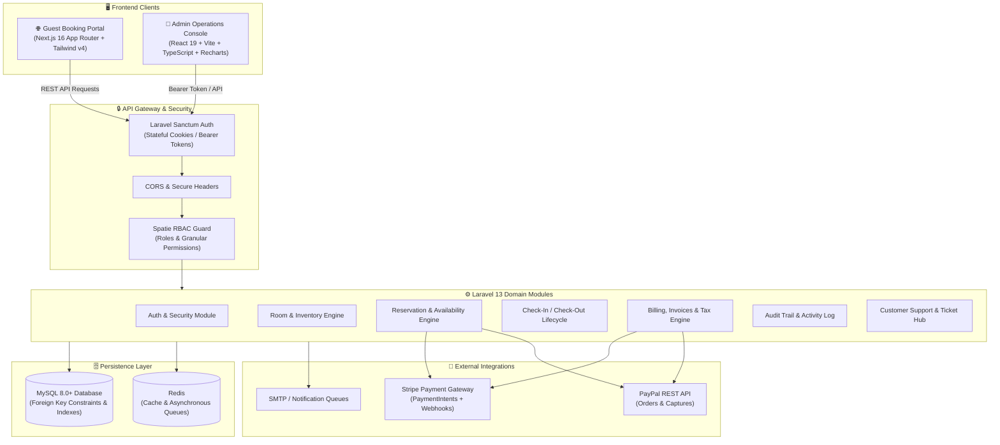
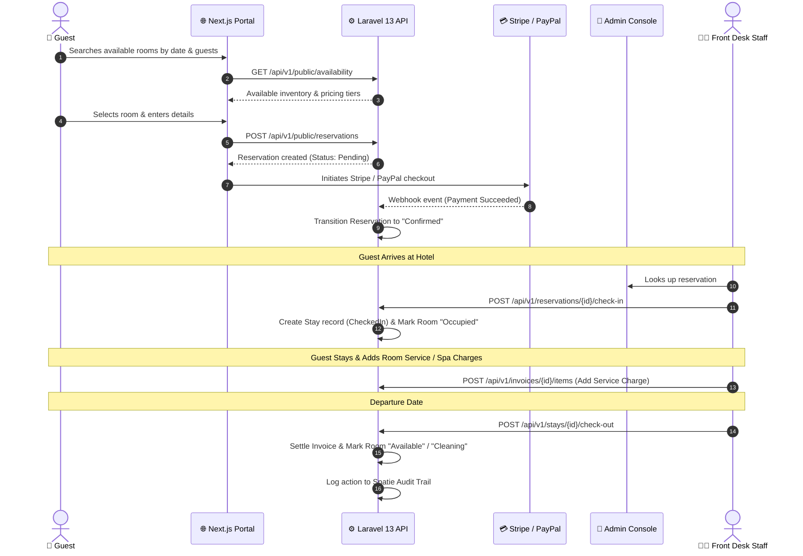

# 🏨 Grand Luxury HMS — Enterprise Hotel Management & Booking Platform

[](https://laravel.com)
[](https://www.php.net)
[](https://nextjs.org)
[](https://react.dev)
[](https://www.typescriptlang.org)
[](https://tailwindcss.com)
[](https://stripe.com)
[](https://paypal.com)
[](https://spatie.be/docs/laravel-permission)
[](https://opensource.org/licenses/MIT)

**Grand Luxury HMS** is an enterprise-grade, full-stack monorepo Hotel Management & Guest Booking System engineered for modern hospitality enterprises. Built following **Domain-Driven Design (DDD)** and **Clean Architecture**, this platform features:

1. **Modular Laravel 13 REST API** with granular Role-Based Access Control (RBAC), multi-gateway checkout (Stripe & PayPal), and comprehensive audit trail logging.
2. **Next.js 16 App Router Guest Portal** for high-performance, SEO-optimized room browsing and instant reservation bookings.
3. **React 19 + TypeScript + Vite Admin Operations Console** equipped with real-time analytics, room inventory management, front-desk check-in/out workflows, billing & invoicing, and ticket support.

---

## ⚡ Recruiter & Reviewer Quick-Access (Pre-Seeded Demo)

The project includes an **out-of-the-box comprehensive database seeder** with realistic rooms, active stays, past bookings, Stripe/PayPal invoices, customer support message threads, and activity logs.

> **Default Password for all seed accounts**: `password`

| Role | Email Address | Access Level & Permissions |
| :--- | :--- | :--- |
| **Super Admin** | `admin@hms.com` | Complete system access: User management, RBAC roles, audit logs, financial reports, system settings. |
| **Hotel Manager** | `manager@hms.com` | Operational control: Room inventory, reservation approvals, invoices, billing records, guest CRM. |
| **Front Desk / Receptionist** | `receptionist@hms.com` | Daily front desk: Guest check-in, check-out, room status updates, guest lookups. |
| **Customer Support / Help Desk** | `helpdesk@hms.com` | Support inbox: Guest message threads, inquiries, reservation lookups, newsletter subscriber management. |
| **Housekeeping & Staff** | `staff@hms.com` | Floor operations: Room inspection, maintenance status updates, view-only schedule. |
| **Verified Guest** | `guest@hms.com` | Client portal: View active booking details, invoices, and reservation history. |

---

## 🏛️ System Architecture

The monorepo separates operational concerns into isolated, highly scalable layers:


```mermaid
flowchart TD
    subgraph ClientLayer["🖥️ Frontend Clients"]
        GP["🌐 Guest Booking Portal\n(Next.js 16 App Router + Tailwind v4)"]
        AP["💼 Admin Operations Console\n(React 19 + Vite + TypeScript + Recharts)"]
    end

    subgraph SecurityGateway["🔒 API Gateway & Security"]
        SANCTUM["Laravel Sanctum Auth\n(Stateful Cookies / Bearer Tokens)"]
        CORS["CORS & Secure Headers"]
        RBAC["Spatie RBAC Guard\n(Roles & Granular Permissions)"]
    end

    subgraph CoreBackend["⚙️ Laravel 13 Domain Modules"]
        AUTH_M["Auth & Security Module"]
        ROOM_M["Room & Inventory Engine"]
        RES_M["Reservation & Availability Engine"]
        STAY_M["Check-In / Check-Out Lifecycle"]
        BILL_M["Billing, Invoices & Tax Engine"]
        AUDIT_M["Audit Trail & Activity Log"]
        SUPP_M["Customer Support & Ticket Hub"]
    end

    subgraph Integrations["🔌 External Integrations"]
        STRIPE["Stripe Payment Gateway\n(PaymentIntents + Webhooks)"]
        PAYPAL["PayPal REST API\n(Orders & Captures)"]
        MAIL["SMTP / Notification Queues"]
    end

    subgraph Persistence["🗄️ Persistence Layer"]
        DB[("MySQL 8.0+ Database\n(Foreign Key Constraints & Indexes)")]
        REDIS[("Redis\n(Cache & Asynchronous Queues)")]
    end

    GP -->|REST API Requests| SANCTUM
    AP -->|Bearer Token / API| SANCTUM
    SANCTUM --> CORS --> RBAC --> CoreBackend

    RES_M --> STRIPE & PAYPAL
    BILL_M --> STRIPE & PAYPAL
    CoreBackend --> DB
    CoreBackend --> REDIS
    CoreBackend --> MAIL
```

---

## 🔄 End-to-End Hospitality Business Lifecycle


```mermaid
sequenceDiagram
    autonumber
    actor Guest as 🧑 Guest
    participant Web as 🌐 Next.js Portal
    participant API as ⚙️ Laravel 13 API
    participant Pay as 💳 Stripe / PayPal
    participant Admin as 💼 Admin Console
    actor Staff as 👨‍💼 Front Desk Staff

    Guest->>Web: Searches available rooms by date & guests
    Web->>API: GET /api/v1/public/availability
    API-->>Web: Available inventory & pricing tiers
    Guest->>Web: Selects room & enters details
    Web->>API: POST /api/v1/public/reservations
    API-->>Web: Reservation created (Status: Pending)
    
    Web->>Pay: Initiates Stripe / PayPal checkout
    Pay-->>API: Webhook event (Payment Succeeded)
    API->>API: Transition Reservation to "Confirmed"
    
    Note over Guest,Staff: Guest Arrives at Hotel
    Staff->>Admin: Looks up reservation
    Staff->>API: POST /api/v1/reservations/{id}/check-in
    API->>API: Create Stay record (CheckedIn) & Mark Room "Occupied"
    
    Note over Guest,Staff: Guest Stays & Adds Room Service / Spa Charges
    Staff->>API: POST /api/v1/invoices/{id}/items (Add Service Charge)
    
    Note over Guest,Staff: Departure Date
    Staff->>API: POST /api/v1/stays/{id}/check-out
    API->>API: Settle Invoice & Mark Room "Available" / "Cleaning"
    API->>API: Log action to Spatie Audit Trail
```

---

## 📁 Monorepo Directory Structure

```text
hotel_management_system/
├── backend/                       # Laravel 13 Enterprise REST API
│   ├── app/
│   │   ├── Http/                  # Global API Controllers, Resources & Middlewares
│   │   ├── Models/                # Core Eloquent Models (User, Room, Amenity, Tag, Support...)
│   │   └── Modules/               # Domain-Driven Architecture (DDD)
│   │       ├── ActivityLog/       # Audit trail services & observers
│   │       ├── Auth/              # Multi-guard authentication & token issuance
│   │       ├── Billing/           # Invoices, itemization, payments & tax calculations
│   │       ├── Guest/             # Guest CRM & historical profile logs
│   │       ├── Media/             # S3 / Local media asset attachments
│   │       ├── Notification/      # System & email notifications
│   │       ├── Payment/           # Stripe & PayPal gateway drivers
│   │       ├── Reservation/       # Room availability & booking engine
│   │       ├── Room/              # Room types, capacity, pricing & inventory
│   │       ├── Shared/            # Shared Enums (RoomStatus, StayStatus, InvoiceStatus...)
│   │       └── Stay/              # Real-time check-in, key assignment & check-out
│   ├── database/
│   │   ├── migrations/            # 19 Schema migrations with relational integrity
│   │   └── seeders/               # 11 Modular seeders for instant complete demo testing
│   ├── routes/
│   │   └── api.php                # Structured API v1 endpoints
│   └── composer.json              # Backend dependencies (PHP 8.4, Laravel 13, Sanctum, Spatie)
│
├── admin-app/                     # Operations & Front-Desk Management Portal
│   ├── src/
│   │   ├── api/                   # Typed API service layers (Dashboard, Rooms, Billing, Audits)
│   │   ├── auth/                  # RBAC route guards & Auth context provider
│   │   ├── components/            # Reusable UI widgets, modal forms, status badges
│   │   ├── layouts/               # Dashboard sidebar, header, navigation shell
│   │   ├── pages/                 # Full pages: Dashboard, Rooms, Bookings, Guests, Billing,
│   │   │                          # Support, Newsletter, Users & Roles, Audit Logs, Settings
│   │   └── types/                 # Strict TypeScript interface contracts
│   ├── vite.config.ts             # Vite build configuration + backend dev proxy
│   └── package.json               # React 19, TypeScript, Tailwind CSS v4, Recharts
│
└── frontend-app/                  # High-Performance Public Guest Booking Portal
    ├── src/
    │   ├── app/                   # Next.js 16 App Router (Home, Rooms, Booking Wizard, Contact)
    │   ├── components/            # Hero section, Room Card, Availability Filter, Footer
    │   └── lib/                   # Axios client & formatting utilities
    ├── next.config.ts             # Next.js 16 SSR & image domain configuration
    └── package.json               # Next.js 16, React 19, Tailwind CSS v4, Lucide Icons
```

---

## 🌟 Core Features & Modules Overview

### 1. 🏨 Room & Inventory Engine
* **Dynamic Room Categories**: Standard, Deluxe, Executive Suite, and Presidential Suite with capacity tiers and base rates.
* **Granular Amenities & Tags**: Rich tagging (`Ocean View`, `City Skyline`, `Executive Lounge`, `High Floor`) and amenities (`High-Speed Wi-Fi`, `Jacuzzi Tub`, `55" 4K Smart TV`).
* **Conflict-Free Availability Calculation**: High-performance overlapping date range queries preventing double bookings.

### 2. 📅 Reservation & Front-Desk Stay Lifecycle
* **Guest Booking Wizard**: Seamless date selection, guest counter, pricing estimation, and special request notes.
* **Front-Desk Check-In / Check-Out**: Automated transition from confirmed booking to active stay with timestamp tracking.
* **Room Status Automation**: Statuses automatically toggle (`available` ➡️ `occupied` ➡️ `cleaning/maintenance` ➡️ `available`).

### 3. 💳 Billing, Invoicing & Dual Payment Gateway
* **Itemized Invoicing**: Automatic line items for room nights, food & beverage, spa services, municipal taxes, and service charges.
* **Stripe Integration**: Credit cards, Apple Pay, and Google Pay via secure checkout with server-side webhook reconciliation.
* **PayPal REST Integration**: Express checkout order creation and asynchronous capture.
* **Partial Payments & Deposits**: Tracks `total_amount`, `amount_paid`, and `balance_due`.

### 4. 👥 Enterprise Security & Role-Based Access Control (RBAC)
* **Spatie Laravel Permission**: 36 distinct permissions organized under 6 roles (`admin`, `manager`, `receptionist`, `help_desk`, `staff`, `customer`).
* **Route Middleware Shields**: Protected by `auth:sanctum` and role-specific gates (`role:admin`, `role:manager|receptionist`).
* **Auditing & Compliance**: All critical actions (logins, status changes, payments, cancellations) recorded via **Spatie Activitylog** with user ID, causer, IP address, and payload diffs.

### 5. 💬 Customer Support & Engagement Center
* **Live In-App Support Inbox**: Threaded conversations between guests and customer service staff with message direction flags (`in`/`out`).
* **Ticket Status Tracking**: Manage tickets across `open`, `pending`, and `closed` states.
* **Newsletter Subscriber CRM**: Collect, manage, and filter promotional email subscribers.

### 6. 📊 Real-Time Analytics Dashboard
* **Executive Metrics**: Occupancy rate, total available rooms, active guests in-house, total bookings, today's gross revenue.
* **Visual Data Charts**: Revenue trend bar/line charts and room status distribution pie charts powered by **Recharts**.

---

## 🚀 Local Installation & Developer Workflow

### Prerequisites
* **PHP** >= 8.3 (tested with PHP 8.4) with extensions: `pdo_mysql`, `mbstring`, `openssl`, `curl`, `json`
* **Composer** >= 2.6
* **Node.js** >= 20.x & **npm** >= 10.x
* **MySQL** >= 8.0 or MariaDB
* **Git**

---

### Step 1: Clone the Repository
```bash
git clone https://github.com/sajusun/hotel_management_system.git
cd hotel_management_system
```

---

### Step 2: Backend Setup (Laravel 13 API)
```bash
cd backend

# 1. Install Composer dependencies
composer install

# 2. Setup environment file
cp .env.example .env

# 3. Configure your database in .env:
# DB_CONNECTION=mysql
# DB_HOST=127.0.0.1
# DB_PORT=3306
# DB_DATABASE=hms_database
# DB_USERNAME=root
# DB_PASSWORD=your_password

# 4. Generate application key
php artisan key:generate

# 5. Run migrations and populate the complete demo database
php artisan migrate --seed

# 6. Start the Laravel development server
php artisan serve --port=8000
```
> **Backend API URL**: `http://127.0.0.1:8000/api/v1`

---

### Step 3: Admin Operations Portal Setup (React 19 + Vite)
```bash
cd ../admin-app

# 1. Install Node dependencies
npm install

# 2. Setup environment file
cp .env.example .env
# Default points to http://127.0.0.1:8000

# 3. Start Vite development server
npm run dev
```
> **Admin Dashboard**: `http://localhost:5173`
> Log in with `admin@hms.com` / `password` or `manager@hms.com` / `password`.

---

### Step 4: Public Guest Portal Setup (Next.js 16 App Router)
```bash
cd ../frontend-app

# 1. Install Node dependencies
npm install

# 2. Setup environment file
cp .env.example .env.local
# NEXT_PUBLIC_API_URL=http://127.0.0.1:8000/api/v1

# 3. Start Next.js development server
npm run dev
```
> **Guest Website**: `http://localhost:3000`

---

## 🔑 Key API Endpoints Reference

| Method | Endpoint | Description | Auth / Role |
| :--- | :--- | :--- | :--- |
| `POST` | `/api/v1/auth/login` | Staff / Guest authentication & Sanctum token generation | Public |
| `POST` | `/api/v1/auth/logout` | Revoke current user authentication token | Authenticated |
| `GET` | `/api/v1/public/room-types` | Public room catalog with capacity & base rates | Public |
| `GET` | `/api/v1/public/availability` | Query real-time room availability across date ranges | Public |
| `POST` | `/api/v1/public/reservations` | Submit online guest reservation request | Public |
| `GET` | `/api/v1/dashboard/stats` | Occupancy, revenue charts & check-in velocity | Admin / Manager |
| `GET` | `/api/v1/rooms` | List all rooms with filter by floor, status, type | Staff |
| `POST` | `/api/v1/rooms` | Create new room with attached amenities & tags | Admin / Manager |
| `POST` | `/api/v1/reservations/{id}/check-in` | Transition booking to active Stay & assign room key | Receptionist / Admin |
| `POST` | `/api/v1/stays/{id}/check-out` | Settle bill & complete guest check-out | Receptionist / Admin |
| `GET` | `/api/v1/invoices` | List invoices with status (paid, issued, draft) | Admin / Manager |
| `POST` | `/api/v1/payments/{id}/initiate` | Generate Stripe / PayPal checkout session | Authenticated |
| `POST` | `/api/v1/webhooks/stripe` | Secure webhook handler for asynchronous Stripe events | Public / Webhook Signature |
| `GET` | `/api/v1/support/conversations` | Support ticket list with thread counters | Help Desk / Admin |
| `POST` | `/api/v1/support/conversations/{id}/reply`| Send support staff response message | Help Desk / Admin |
| `GET` | `/api/v1/audit-logs` | Comprehensive security & audit trail | Admin Only |
| `GET` | `/api/v1/users` | Manage staff accounts and assign Spatie RBAC roles | Admin Only |
| `GET/PUT`| `/api/v1/settings/site` | View and update hotel general configuration | Admin Only |

---

## 🛡️ Security & Enterprise Best Practices

* **Zero-Trust Role-Based Authorization**: Enforced at the route, controller, and database policy levels using Spatie Permissions.
* **Stateful & Token Authentication**: Laravel Sanctum with cookie-based CSRF protection for browsers and Bearer tokens for mobile/external APIs.
* **SQL Injection & XSS Immunity**: 100% parameterized queries via Eloquent ORM, strict input request validation, and HTML sanitization.
* **Cryptographic Webhook Verification**: Stripe and PayPal webhooks reject requests lacking valid cryptographic signature headers.
* **Activity & Audit Logging**: Automatic auditing on critical mutations ensuring regulatory and operational accountability.

---

## 🧪 Testing & Code Quality

```bash
# Backend Quality Checks & Unit/Feature Tests
cd backend
php artisan test
vendor/bin/pint --test

# Admin App Type Checking & Linting
cd ../admin-app
npm run lint
npx tsc --noEmit

# Frontend App Linting
cd ../frontend-app
npm run lint
```

---

## 🤝 Contribution Guidelines

1. **Fork the Repository**
2. **Create a Feature Branch** (`git checkout -b feature/hotel-feature`)
3. **Commit your Changes** (`git commit -m 'feat: Add luxury amenity filter'`)
4. **Push to the Branch** (`git push origin feature/hotel-feature`)
5. **Open a Pull Request**

---

## 📄 License

This project is open-source software licensed under the **[MIT License](LICENSE)**.

---

## 👨‍💻 Author & Contact

**Sakhawat Hossain (Saju)**  
*Full-Stack Software Engineer & Solutions Architect*  

* **GitHub**: [@sajusun](https://github.com/sajusun)
* **Project Repository**: [hotel_management_system](https://github.com/sajusun/hotel_management_system)
* **Email**: [sajuislam266@gmail.com](mailto:sajuislam266@gmail.com)
* **LinkedIn**: [linkedin.com/in/sakhawat-hossain-saju](https://www.linkedin.com/in/sajusun)

---

⭐ *If you find this project impressive or helpful for your hospitality management explorations, feel free to give it a star on GitHub!*
