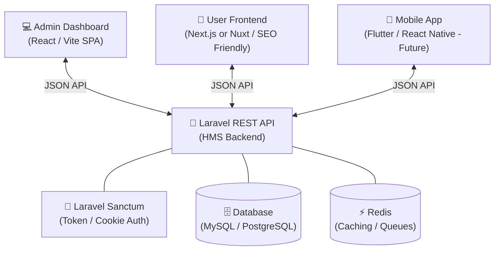

# Headless Architecture & Implementation Plan

This document outlines the architecture, technology stack, and implementation plan for the fully headless, API-driven Hotel Management System (HMS). 

In this architecture, the Laravel backend acts strictly as the "brain" (providing data and business logic), while separate client applications handle the UI.

---

## 🏗️ 1. High-Level Architecture Overview



---

## 🛠️ 2. Proposed Directory Structure

To keep the projects organized without cluttering the backend repository, we recommend a **Monorepo** structure or side-by-side repositories. 

**Recommended File System Layout:**
```text
/Herd
 ├── /HMS-Backend        <-- (Your current Laravel codebase)
 │    ├── app/Modules/
 │    ├── routes/api.php
 │    └── ...
 │
 ├── /HMS-Admin          <-- (React + Vite SPA)
 │    ├── src/
 │    │   ├── components/
 │    │   ├── pages/
 │    │   ├── services/  <-- API client (Axios/Fetch)
 │    │   └── store/     <-- Zustand / Redux
 │    └── package.json
 │
 └── /HMS-Frontend       <-- (Next.js or Nuxt - Public facing)
      ├── app/           <-- (Next App Router)
      ├── components/
      ├── public/
      └── package.json
```

---

## 📋 3. Step-by-Step Implementation Plan

### Phase 1: Backend API Preparation (Laravel)
Since your `api/v1` routes are already structured modularly, the focus here is strictly on security and CORS.
1.  **Install & Configure Laravel Sanctum:**
    *   Set up stateful domain configuration for SPA authentication (if Admin/Frontend are on subdomains like `admin.hms.local` and `www.hms.local`).
    *   Configure API Token generation for the Mobile App.
2.  **Configure CORS (`config/cors.php`):**
    *   Allow requests from your local dev servers (e.g., `localhost:3000`, `localhost:5173`).
    *   Ensure credentials (cookies) are allowed for Sanctum SPA authentication.
3.  **Role-Based Access Control (RBAC):**
    *   Install `spatie/laravel-permission`.
    *   Create `SuperAdmin`, `Receptionist`, and `Guest` roles.
    *   Protect the `api/v1` routes using role middleware.

### Phase 2: Admin Dashboard (React + Vite)
The admin dashboard does not need SEO, so a standard React SPA is the fastest and most efficient choice.
1.  **Initialize Project:** `npm create vite@latest hms-admin -- --template react-ts`
2.  **UI Framework:** Install Tailwind CSS v4 and a component library like `shadcn/ui` or `MUI` for rapid dashboard building.
3.  **Routing:** Setup `react-router-dom` with protected routes.
4.  **API Client:** Configure Axios to automatically attach CSRF tokens and handle 401 Unauthorized responses to redirect to login.
5.  **Core Features to Build:**
    *   Auth (Login/Logout).
    *   Room grid and status toggler.
    *   Interactive Reservation Calendar (using a library like `react-big-calendar`).
    *   Invoice generator and payment recording form.

### Phase 3: User Frontend (Next.js or Nuxt)
The public-facing site needs SEO to rank on Google (for terms like "Hotel in [City]"). Server-Side Rendering (SSR) is essential.
1.  **Initialize Project:** `npx create-next-app@latest hms-frontend`
2.  **UI Design:** Tailwind CSS for a premium, high-converting booking experience.
3.  **Core Features to Build:**
    *   Landing page with featured rooms.
    *   Date picker and availability search (talking to `GET /api/v1/availability`).
    *   Multi-step booking wizard.
    *   User dashboard (Past stays, Invoices) utilizing Sanctum authentication.

### Phase 4: Future Mobile App Integration (Flutter)
Because the API is fully decoupled, when you are ready to build the mobile app:
1.  Use Laravel Sanctum's Token-based authentication.
2.  Consume the exact same `GET /api/v1/availability` and `POST /api/v1/reservations` endpoints.
3.  Zero backend modifications required.

---

## 🚦 Next Action Items for Backend

To prepare the backend for this headless architecture, we need to execute the following on the Laravel project:

- [ ] Run `php artisan install:api` (to properly scaffold Sanctum).
- [ ] Configure `config/cors.php` paths and allowed origins.
- [ ] Implement an `AuthController` in a new `Auth` Module for login/logout API endpoints.
