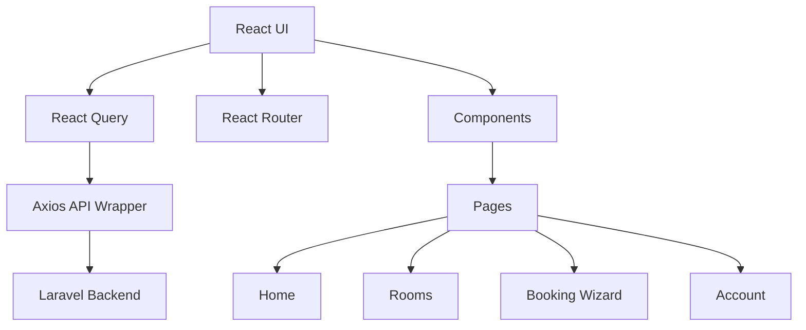

# HMS Frontend Application (Guest Portal)

## Project Purpose
The Frontend App is the public‑facing website where guests can browse rooms, check availability, make bookings, and manage their stay.

## Tech Stack
- **Framework:** React 18 with Vite
- **Language:** TypeScript (tsx)
- **Styling:** Tailwind CSS
- **State Management:** React Query for server state + local component state
- **Routing:** React Router v6
- **HTTP Client:** Axios wrapper (`src/api/axios.ts`)
- **Form handling:** React Hook Form + Yup
- **Testing:** Jest + React Testing Library, Cypress for end‑to‑end

## Getting Started
```bash
cd frontend-app
npm install          # install dependencies
npm run dev          # start Vite dev server (http://localhost:5173)
```
Create a `.env` file (or add to `.env.local`) with the API base URL:
```
VITE_API_URL=http://localhost:8000/api/v1
```
Make sure the backend API is running (see the backend README).

## Architecture Diagram


## Folder Structure
```
src/
 ├─ api/                # axios instance with interceptors
 ├─ components/         # reusable UI components (Card, Carousel, Modal)
 │   ├─ Layout/         # Header, Footer, NavBar
 │   ├─ Rooms/          # RoomCard, RoomList, AvailabilityCalendar
 │   └─ Shared/         # Loader, Toast, ErrorBoundary
 ├─ hooks/              # custom hooks (useRooms, useBooking, useAuth)
 ├─ pages/              # route‑level pages (Home, Rooms, Booking, Account)
 ├─ routes/             # route definitions, PrivateRoute for account pages
 ├─ utils/              # helpers (date utils, price formatter)
 └─ assets/             # static images, icons
```

## API Integration (React Query)
All data fetching is performed with **React Query** hooks that use the axios instance. Example hook:
```ts
export const useRooms = (params?: RoomSearchParams) =>
  useQuery(['rooms', params], () => api.get<Room[]>('/rooms', { params }));
```
Benefits: automatic caching, background refetch, stale‑while‑revalidate.

## Building for Production
```bash
npm run build   # creates `dist/`
# Deploy the `dist/` folder to any static host (Netlify, Vercel, NGINX)
```

## Contributing
1. Create a feature branch: `git checkout -b feat/<name>`
2. Follow ESLint/Prettier formatting (`npm run lint`).
3. Write unit tests for new components/hooks.
4. Open a Pull Request.

---
*Generated by Antigravity AI*
